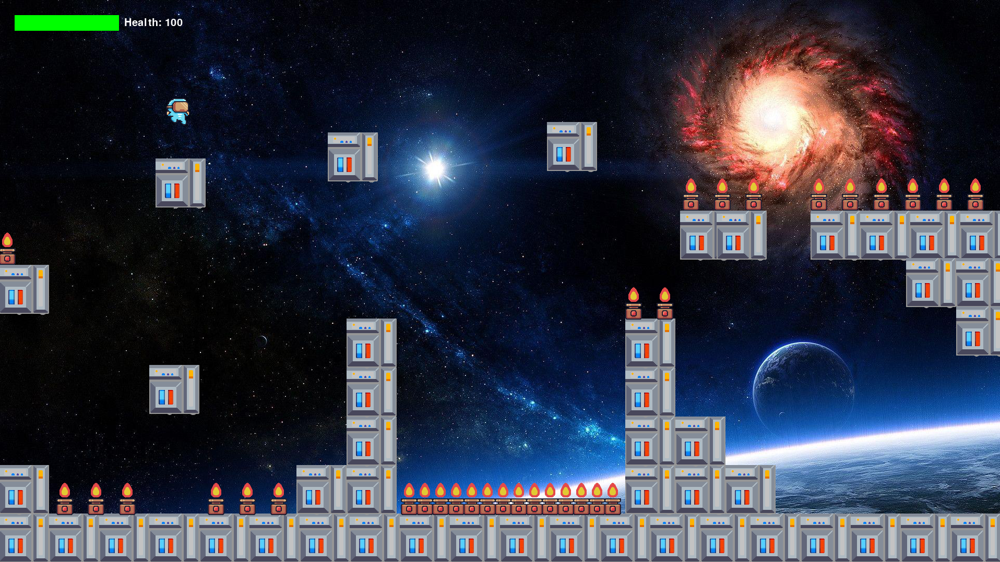

# Platformer Game

A simple platformer game built with Pygame.

## Game Preview



## Controls

- Arrow keys to move left/right
- Space to jump
- Avoid fire traps
- Reach the right side of the screen to win!

## Running with Docker

### Prerequisites

- Docker
- Docker Compose
- X11 server (for display)

### Running the game

1. Build and run the container:

```bash
docker-compose up --build
```

2. To stop the game:

```bash
docker-compose down
```

## Running without Docker

### Prerequisites

- Python 3.9+
- Pygame 2.5.2

### Installation

```bash
pip install -r requirements.txt
```

### Running the game

```bash
python src/run.py
```
